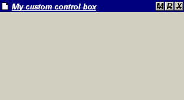



## Custom Control Box \(a must have\!\)

### Description

2 custom controls are included in this project. Drag control will allow you to move the form around using any control. controlbox is a custom controlbox with 3 buttons which can be eneabled/disabled, for which you set caption and font properties, a popup menu, icon propery which can also be changed. The custom controlbox can be minimized/maximized/closed like a normal controlbox. This is a must have if you are tired of having same control box every time!!! <please vote for me :) >
 
### More Info
 

             |
---                |---
**Submitted On**   |2000-08-16 17:07:38
**By**             |[Izek](https://github.com/Planet-Source-Code/PSCIndex/blob/master/ByAuthor/izek.md)
**Level**          |Advanced
**User Rating**    |4.7 (14 globes from 3 users)
**Compatibility**  |VB 6\.0
**Category**       |[Custom Controls/ Forms/  Menus](https://github.com/Planet-Source-Code/PSCIndex/blob/master/ByCategory/custom-controls-forms-menus__1-4.md)
**World**          |[Visual Basic](https://github.com/Planet-Source-Code/PSCIndex/blob/master/ByWorld/visual-basic.md)
**Archive File**   |[CODE\_UPLOAD90288172000\.zip](https://github.com/Planet-Source-Code/izek-custom-control-box-a-must-have__1-10744/archive/master.zip)

